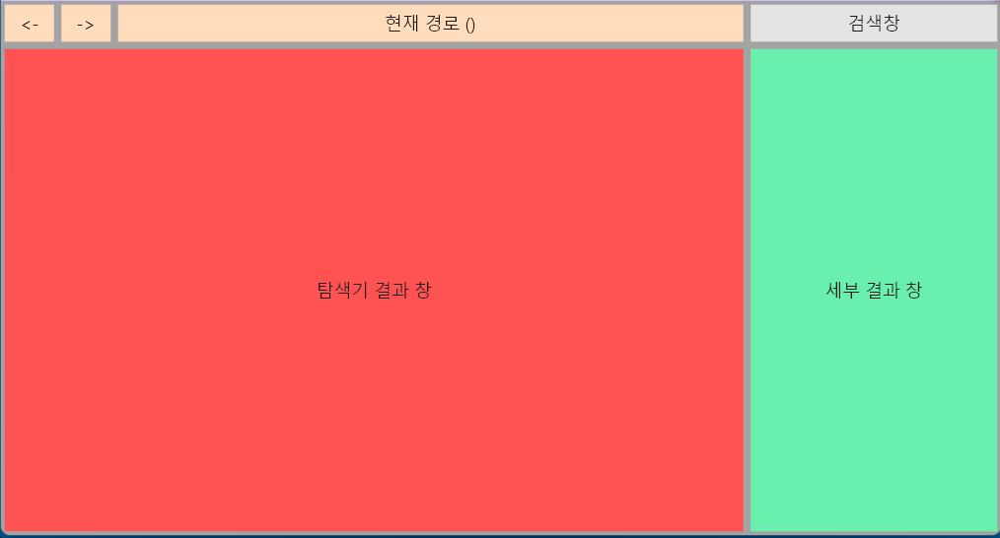

# GUI 파트

*확정된 사안이 아니며 구현 어려움이나 이후 프로젝트 진행 사항에 따라 바뀔수 있음*

## 요구사항

- FileExplorer 클래스의 생성자에 front_api 인자를 받음

## FrontAPI

`check_unmatched_ext(fileinfo:dict)`

`ㅁ`

``

## 필요한 기능

- 현재 경로를 표시하는 입력가능한 창
- 드래그로 다중 선택
- 컨텍스트 메뉴
- 검색 기능
- *이후 추가 예정*

### 현재 경로

- 입력가능한 텍스트 창
- 현재 디렉토리 경로를 표시
- 직접 입력해 해당 디렉토리로 이동가능

### 검색창

- 입력칸과 고급검색 버튼
- 입력칸에 입력해 검색 api 호출, 결과를 `탐색기 결과 창`에 표시
- 고급검색 버튼 클릭시 `세부 결과 창`에 검색 옵션 표시됨

### 탐색기 결과 창

- 현재 경로의 파일이나 검색 결과에 따른 파일 결과 표시
- `FILE_INFO` 포맷에 따라 파일, 디렉토리 정보를 표시
- 표시할 정보
    - 파일 이름
    - 마지막 변경날짜
    - 마지막 접근날짜
    - 생성 날짜
    - 파일 경로

*QTreeView* 를 활용할 수 있는가?

### 컨텍스트 메뉴

- 탐색기 결과 창의 파일을 우클릭 해 컨텍스트 메뉴를 염
- (이후 프로젝트 진행에 따라 추가될 예정이니 확장성 있도록 구현 필요)
- 드래그 후 다중 선택된 

### 세부 결과 창

- '탐색기 결과 창'에서 파일 포커스 시(한번 클릭시) 세부 정보 표시
    - 세부 정보는 프로젝트 진행하며 결정
- 검색창의 고급검색 시 고급검색 옵션 표시
    - 파일 이름 (텍스트)
    - 마지막 변경날짜 (날짜, 범위)
    - 마지막 접근날짜 (날짜, 범위)
    - 생성 날짜 (날짜, 범위)
    - 파일 크기 (날짜, 범위)

*WIP*